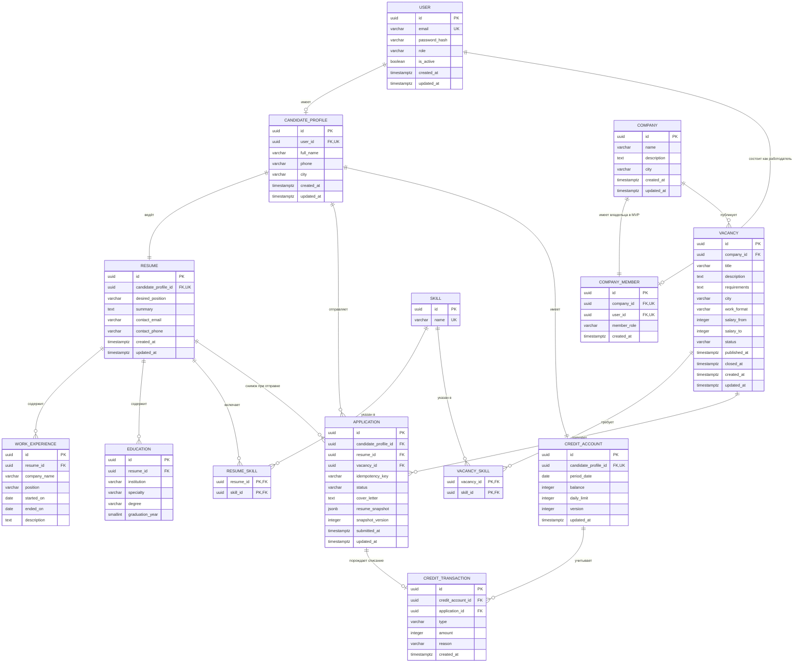

# JobMatch — принципиальная ERD

**Версия:** 0.1 от 18 сентября 2026 года.

**Основание:** [MVP](../requirements/mvp.md).

**Статус:** готово к техническому ревью Клима и Альберта; имена и типы должны быть сверены с EF Core перед первой миграцией.

## Диаграмма

## Кардинальности и назначение

- `User` имеет ровно одну пользовательскую роль. Роль `Candidate` допускает один `CandidateProfile`, роль `Employer` — одно членство `CompanyMember`.
- У соискателя ровно одно актуальное `Resume`; опыт, образование и навыки — дочерние записи.
- `ResumeSkill` и `VacancySkill` разрешают связь многие-ко-многим со справочником `Skill`.
- В MVP у компании ровно один работодатель-владелец. Таблица `CompanyMember` оставлена явно, чтобы права проверялись через принадлежность, а расширение до команды рекрутеров не меняло связи вакансий.
- Компания имеет много вакансий. Закрытие вакансии меняет статус, а не удаляет запись.
- Соискатель может иметь много откликов, но не больше одного на конкретную вакансию. Отклик ссылается на исходное резюме и хранит неизменяемый снимок данных в `resume_snapshot`.
- У соискателя один `CreditAccount`; журнал `CreditTransaction` хранит начисления/обновления дневного лимита и списания.
- Успешный отклик связан максимум с одной транзакцией списания. Создание отклика, уменьшение баланса и запись транзакции выполняются атомарно.

## Ограничения уровня БД

Обязательные ограничения первой миграции:

| Правило | Ограничение |
|---|---|
| Уникальный email без учёта регистра | уникальный индекс по `lower(user.email)` |
| Одна профильная сущность на аккаунт | `UNIQUE(candidate_profile.user_id)` и `UNIQUE(company_member.user_id)` |
| Одно резюме | `UNIQUE(resume.candidate_profile_id)` |
| Одна компания на работодателя в MVP | `UNIQUE(company_member.company_id)` и `UNIQUE(company_member.user_id)` |
| Один отклик на вакансию | `UNIQUE(application.candidate_profile_id, application.vacancy_id)` |
| Защита повторного запроса | `UNIQUE(application.candidate_profile_id, application.idempotency_key)` |
| Неотрицательный остаток | `CHECK(credit_account.balance >= 0)` |
| Корректный лимит | `CHECK(credit_account.daily_limit > 0 AND balance <= daily_limit)` |
| Положительная сумма операции | `CHECK(credit_transaction.amount > 0)` |
| Корректная зарплата | значения неотрицательны; `salary_from <= salary_to`, если заданы оба |
| Корректные даты опыта | `ended_on IS NULL OR ended_on >= started_on` |
| Допустимые статусы | `CHECK` либо PostgreSQL enum для ролей, статусов и формата работы |

Для конкурентного списания backend обновляет счёт условием `balance > 0` внутри транзакции либо использует поле `version` как токен оптимистической конкуренции. Проверка только в интерфейсе недостаточна.

## Удаление и история

- Пользователи, компании, вакансии и отклики не удаляются каскадно в обычных сценариях MVP. Деактивация пользователя и закрытие вакансии выполняются сменой признака или статуса.
- Внешние ключи от `Application` к `Vacancy`, `CandidateProfile` и `Resume` используют `RESTRICT`/`NO ACTION`. Поэтому заявки сохраняются после закрытия вакансии.
- `resume_snapshot` содержит только данные, необходимые работодателю: ФИО, контакты, желаемую должность, описание, навыки, опыт и образование. Пароль, служебные роли и баланс в снимок не входят.
- Формат снимка имеет `snapshot_version`, чтобы старые заявки оставались читаемыми после изменения структуры резюме.

## Что проверить перед миграцией

1. Согласовать названия enum и полей с `api/openapi.yaml`.
2. Решить с backend-командой, используется ли таблица `User` напрямую или расширяет таблицу ASP.NET Core Identity; предметные связи должны остаться теми же.
3. Зафиксировать стратегию ежедневного обновления лимита: ленивое обновление при первом запросе нового московского дня либо отдельная задача. Для MVP предпочтительно ленивое обновление.
4. Проверить индексы каталога: статус, город, формат работы, дата публикации и полнотекстовый поиск по названию.
